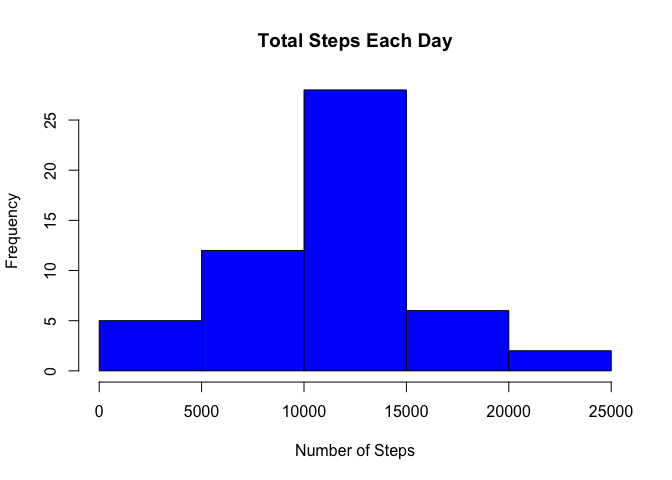
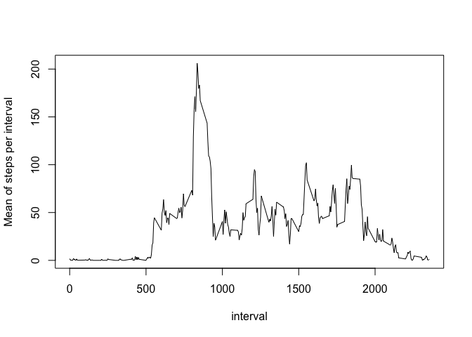
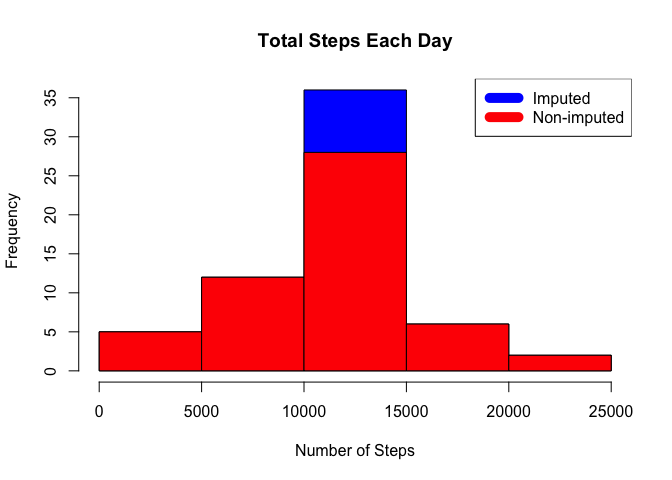
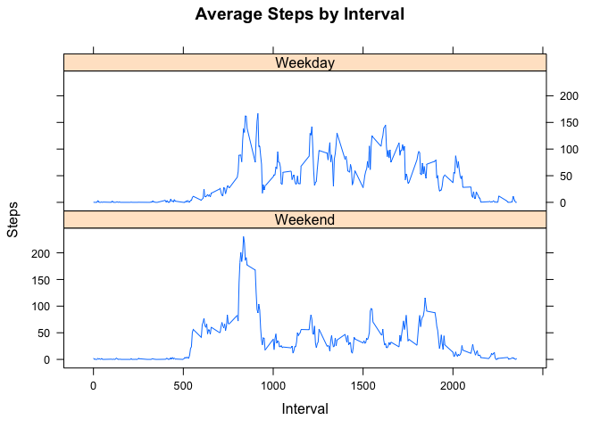

# Reproducible Research: Peer Assessment 1


## Loading and preprocessing the data

Let install and load required packages first


```r
if (!"dplyr" %in% installed.packages()) install.packages("dplyr",  dependencies = c("Depends", "Suggests"))
library(dplyr)
```

```
## 
## Attaching package: 'dplyr'
## 
## The following objects are masked from 'package:stats':
## 
##     filter, lag
## 
## The following objects are masked from 'package:base':
## 
##     intersect, setdiff, setequal, union
```

```r
if (!"lubridate" %in% installed.packages()) install.packages("lubridate",  dependencies = c("Depends", "Suggests"))
library(lubridate)
library(lattice)
```

Download and load data


```r
download.file("https://d396qusza40orc.cloudfront.net/repdata%2Fdata%2Factivity.zip", 
              method = "curl", "activity.zip")
data <- read.csv(unz("activity.zip","activity.csv"), 
                 header=TRUE, sep=",", na.strings=c("NA",""))
```

## What is mean total number of steps taken per day?

Aggregating steps count per day and displaying histogram


```r
daily_steps <- aggregate(steps ~ date, data, sum)
hist(daily_steps$steps, main = paste("Total Steps Each Day"), col="blue", xlab="Number of Steps")
```

 

Calculating mean and median for dayly total steps


```r
daily_steps.mean <- mean(daily_steps$steps)
daily_steps.median <- median(daily_steps$steps)

print (paste("Mean of daily steps:", daily_steps.mean, "Median of daily steps:", daily_steps.median))
```

```
## [1] "Mean of daily steps: 10766.1886792453 Median of daily steps: 10765"
```

## What is the average daily activity pattern?

Calculating average daily activity per interval (removing NA values first)


```r
data.interval <- filter(data, 
                     !is.na(steps)) %>% 
  group_by(interval) %>%
  summarise(msteps=mean(steps)) 
```

Let plot time series. As we can see there more significant activity on average in first half of day.


```r
plot(data.interval, type='l', ylab="Mean of steps per interval")
```

 

Let's identify what interval has contains max number of steps


```r
data.interval[which.max(data.interval$msteps),]
```

```
## Source: local data frame [1 x 2]
## 
##   interval   msteps
##      (int)    (dbl)
## 1      835 206.1698
```

It is interval 875

## Imputing missing values

Calculate and report the total number of missing values in the dataset.
We used complete.cases function to do this.


```r
incomplete <- sum(!complete.cases(data))
print (paste("Number of records with NA:", incomplete))
```

```
## [1] "Number of records with NA: 2304"
```

We will use mean per interval (we calculate it on previous step) to fill out missing values


```r
data.imputed_na<-mutate(data, imputed = is.na(steps)) %>%
    mutate(steps = ifelse(is.na(steps), data.interval$msteps[match(interval, data.interval$interval)], steps))
```

Let's draw histogram


```r
daily_steps.imputed <- aggregate(steps ~ date, data.imputed_na, sum)
hist(daily_steps.imputed$steps, main = paste("Total Steps Each Day"), col="blue", xlab="Number of Steps")
```

 

Calculating mean and median


```r
daily_steps.imputed.mean <- mean(daily_steps.imputed$steps)
daily_steps.imputed.median <- median(daily_steps.imputed$steps)

print(paste("Mean:", daily_steps.imputed.mean, " Median:", daily_steps.imputed.median))
```

```
## [1] "Mean: 10766.1886792453  Median: 10766.1886792453"
```

```r
print(paste("Mean difference:", daily_steps.imputed.mean-daily_steps.mean))
```

```
## [1] "Mean difference: 0"
```

```r
print(paste("Median difference:", daily_steps.imputed.median-daily_steps.median))
```

```
## [1] "Median difference: 1.1886792452824"
```

We dont see big difference in mean and median. It can be explained by result of using our fill-out algorithm.
It use mean values to fill NA - it should have no impact on mean per day.


```r
hist(daily_steps.imputed$steps, main = paste("Total Steps Each Day"), col="blue", xlab="Number of Steps")
hist(daily_steps$steps, main = paste("Total Steps Each Day"), col="red", xlab="Number of Steps", add=T)
legend("topright", c("Imputed", "Non-imputed"), col=c("blue", "red"), lwd=10)
```

 

## Are there differences in activity patterns between weekdays and weekends?

Lets mutate our dataset to add weekend attribute with value=TRUE for weekend
We will use imputed dataset 


```r
data.imputed_na<-mutate(data.imputed_na, date=as.Date(factor(date))) %>%
    mutate(weekend = (wday(date) == 7 | wday(date) ==1))
```

Let draw separate charts of activity for weekends and weekdays
We use imputed data as a source for this chart.


```r
interval_steps <- aggregate(steps ~ interval + weekend, data.imputed_na , mean)
```


```r
strip_legend <-c( "Weekend" , "Weekday" ) 
xyplot(interval_steps$steps ~ interval_steps$interval|interval_steps$weekend, 
       main="Average Steps by Interval",xlab="Interval", ylab="Steps",
       layout=c(1,2), type="l",
       strip=strip.custom(factor.levels=strip_legend))
```

 

It looks like there even more higher level of activity in the first half of the day for weekday
compare with weekend. Activity in the morning also started early on weekends compare with weekdays.
In the same time there is more activity in the evening on weekdays.

